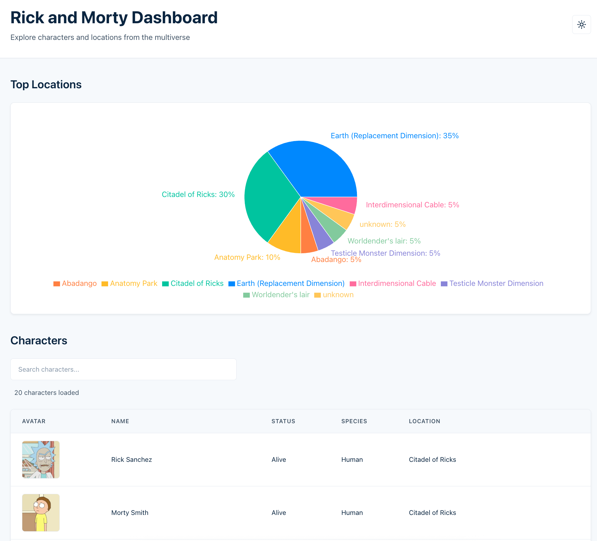

# Rick and Morty Dashboard

Next.js application consuming the Rick & Morty GraphQL API with infinite scroll, live search, and location analytics.



## Quick Start

```bash
pnpm install
pnpm dev        # http://localhost:3000
```

## Requirements

- Node.js 18+
- pnpm (or npm/yarn)

## Commands

```bash
pnpm dev                # Development server
pnpm build              # Production build
pnpm start              # Production server
pnpm lint               # ESLint
pnpm test               # Unit tests (watch)
pnpm test:coverage      # Coverage report
pnpm test:e2e           # E2E tests
pnpm test:e2e:ui        # E2E UI mode
```

## Architecture

### Component Structure (Atomic Design)

```text
src/components/
├── atoms/           # Button, Input, Spinner, TableCell, Icon
├── molecules/       # SearchInput, TableRow, ThemeToggle
├── organisms/       # CharacterTable, LocationChart
└── templates/       # ErrorBoundary, WebVitals
```

### Data Layer

**GraphQL Client:** Apollo Client with custom cache merge strategy
**Pagination:** Cursor-based interface over page-based API
**Search:** Debounced with `useDeferredValue` (React 19)

**Custom Hooks:**

- `useCharacters` - Paginated character fetching with cursor abstraction
- `useSearchCharacters` - Debounced search wrapper
- `useCharactersByLocation` - Parallel batch fetching for chart aggregation
- `useInfiniteScroll` - Generic IntersectionObserver hook
- `useTheme` - Dark mode with localStorage + system preference

### Key Technical Decisions

**1. Pie chart vs Bar chart:**
Assignment summary requests "pizza chart" (pie chart), while component requirements mention "bar chart". Implemented **pie chart** as it better represents part-to-whole relationships for location distribution.

**2. Cursor-based pagination interface:**
The Rick & Morty API uses page numbers, but we expose a cursor-based interface (`hasNextPage`, `fetchNextPage`) by treating `info.next` as the cursor. This abstracts pagination details and enables easier API migrations.

```typescript
// useCharacters.ts
const nextPage = data?.characters?.info?.next;
const hasNextPage = Boolean(nextPage);
```

**3. Cache merge strategy:**
Apollo cache merges paginated results using `keyArgs: ['filter']` to separate cache by search term, resetting on `page: 1` for new searches.

```typescript
// client.ts
merge(existing, incoming, { args }) {
  if (!existing || args?.page === 1) return incoming;
  return {
    ...incoming,
    results: [...existing.results, ...incoming.results]
  };
}
```

**4. Parallel fetching for chart:**
Location chart aggregates ~800 characters by fetching 10 sample pages in parallel (batches of 5) to avoid blocking the UI. Uses `AbortController` for proper cleanup.

**5. React Compiler:**
Enabled automatic memoization, eliminating manual `useMemo`/`useCallback` in most cases. Only used explicitly where ref stability is critical (e.g., `useCharacters` filter).

**6. CSS Modules over CSS-in-JS:**
Zero runtime cost, better build-time optimization, simple mental model. Design tokens via CSS custom properties for theming.

## Tech Stack

- **Framework:** Next.js 16 (App Router, Turbopack)
- **React:** 19.2.0 (React Compiler enabled)
- **TypeScript:** 5.9.3 (strict mode)
- **Data:** Apollo Client 4 + GraphQL
- **Styling:** CSS Modules + Design Tokens
- **Charts:** Recharts 3.3.0
- **Testing:** Vitest + Playwright + MSW

## Testing

**Unit Tests (9):**
All atoms, key molecules, and hooks. Mock GraphQL with MSW.

**E2E Tests (10 scenarios):**
Search, infinite scroll, theme toggle, responsive design, keyboard navigation.

**Coverage:**
~20% LOC. Focused on integration points and user-facing behavior over line coverage metrics.

```bash
pnpm test:coverage    # Vitest coverage
pnpm test:e2e         # Playwright
```

## Features

### Core Requirements ✓

- Infinite scroll table with cursor-based pagination
- Live search by character name (debounced)
- Pie chart of top 10 locations
- Atomic design component structure
- Unit + integration tests

### Additional Features

- Dark mode (system preference aware)
- Design token system (CSS variables)
- TypeScript strict mode (100% type-safe)
- Accessibility (semantic HTML, ARIA, keyboard nav)
- E2E test suite (Playwright)
- Error boundaries with graceful fallbacks
- Performance monitoring (Web Vitals)

## Trade-offs

**Completed:**

- All core requirements
- Dark mode + theming system
- Comprehensive E2E coverage
- Accessibility features

**Deferred (nice-to-haves):**

- Skeleton screens (using spinner instead)
- Higher test coverage (focused on critical paths)
- Virtual scrolling (unnecessary for dataset size)
- Server-side rendering for table (client-side sufficient)
- Storybook (would add for team design system)

**Known limitations:**

- Recharts bundle size (100KB) - acceptable for prototype, would evaluate alternatives for production
- Chart samples 10 pages for performance - adequate for 800 total characters
- No retry logic - API is stable, would add exponential backoff for production
